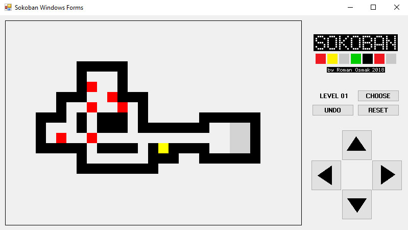

# Sokoban-Windows-Forms-source-code

Исходный код для [Sokoban-Windows-Forms](https://github.com/OsmakRoman/Sokoban-Windows-Forms.git).

Solution для Microsoft Visual Studio 2017.

Игра написана на C# Windows Forms (.NET Framework 4.6).

Вся логика игры вынесена в отдельный класс SokobanCore.cs. 
Может использоваться с другими технологиями визуализации. 
Об окончании уровня сигнализирует событием EndOfLevelEvent.
В целях написания чистого кода обработка хода была подвергнута глубокому рефакторингу
по сравнению с [Sokoban-MFC-source-code](https://github.com/OsmakRoman/Sokoban-MFC-source-code.git).

Содержит 60 полностью функциональных уровней.

Из бонусов:

* Возможность выбрать любой уровень
* Возможность отменить сделанный(е) ход(ы) вплоть до начала уровня
* Возможность начать уровень заново

#

#

